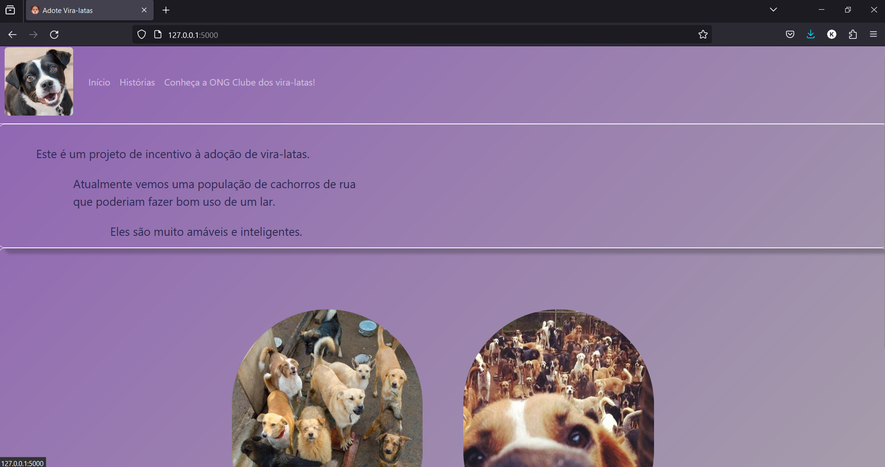

## Projeto desenvolvido com o framework Flask para incentivo à adoção de vira-latas.

#### Imagens obtidas do pinterest

### Tecnologias utilizadas:
- Flask
- Docker
- Gunicorn
- ElephantSQL
- Bootstrap5

### Tarefas:

  &#9744; Adicionar opção de cadastrar imagem no banco de dados

  &#9744; Implementar cadastro e login de usuários

  &#9745; Refatorar css

  &#9745; Consertar navbar
    
  &#9745; Fazer deploy

### Como rodar(Ubuntu):

1. python3 -m venv venv
2. source venv/bin/activate
3. pip install -r requirements.txt
4. flask run

Ou

4. ./docker_entrypoint.sh

### Como rodar(Docker):

1. docker build -t ~nome_da_imagem~ .
2. docker run -ip 5000:5000 ~nome_da_imagem~

### Erro atual:
- 
